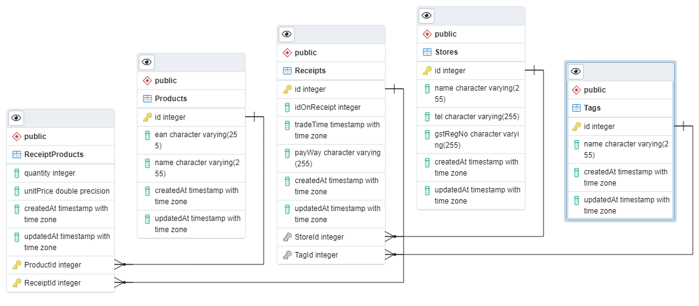

# AImazing Interview Test

## ER Diagram



## APIs

### POST /login

```
Content-Type: application/json

{
  "username": <USERNAME>,
  "password": <PASSWORD>
}

Response:
{
  "token": <TOKEN>
}
```

### POST /receipt

```
Content-Type: multipart/form-data

{
  "receipt": <FILE>,
  "tag": <TAG>
}

Response:
{
  "status": "success"
}
```

### GET /receipt

```
Query Parameters
{
  "tag": <TAG>
}

Response:
{
  "status": "success",
  "receipts": [
    <RECEIPT>,
    <RECEIPT>,
    <RECEIPT>,
    <RECEIPT>,
    <RECEIPT>,
    ...
  ]
}
```

### PUT /receipt

```
Content-Type: application/json

Query Parameters
{
  "id": <ID>,
  "tag": <TAG>
}

Response:
{
  "status": "success"
}
```
